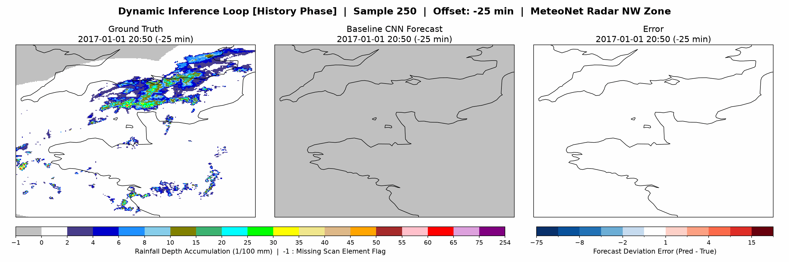

# ⛈️ Precipitation Radar Nowcasting using Deep Learning

<p align="center">
  
</p>
<p align="center"><em>Figure 1: Spatiotemporal nowcasting from historical radar observations to a continuous precipitation forecast.</em></p>

## 📌 Project Overview
This repository features a production-grade, config-driven machine learning pipeline for short-term precipitation radar nowcasting, utilizing high-resolution radar archives from Météo-France's **MeteoNet dataset** (Northwestern France, 2016–2018). 

The application implements a modular PyTorch framework designed to stream large spatiotemporal datasets efficiently, execute automated hyperparameter searches, and serve low-latency forecasts via a containerized FastAPI microservice.

### 🚀 Core Computer Vision & Pipeline Capabilities
- **Spatiotemporal Data Engineering:** Ingests raw, multi-day multidimensional grids and transforms them into clean, "ML-ready" sequence matrices for spatial feature extraction networks.
- **Production MLOps & Architecture:** Enforces diskless in-memory tensor routing, multi-worker parallel I/O, single-stage Conda Docker sandboxing, and automated parameter orchestration.
- **Advanced Vision Verification:** Tailors neural network validation to continuous spatial fields using pixel-level footprint density tracking, categorical threshold masks, and multi-scale selective neighborhood diagnostics.


---

## 📊 Dataset & Meteorological Specifications

The project utilizes the open **MeteoNet** dataset curated by **Météo-France**. The data engineering track focuses on the rainfall radar component for the Northwestern France (NW) territory, ingested directly from compressed multi-day NumPy archives (`.npz`).

| Attribute | Specification |
| --- | --- |
| **Dataset Source** | Météo-France MeteoNet (Larvor et al., 2020) |
| **Target Variable** | Accumulated rainfall depth in hundredths of millimeters (10⁻² mm) |
| **Temporal Resolution** | 5-minute sampling intervals (Up to 3,168 frames per 11-day archive) |
| **Spatial Matrix Dimensions** | Original Grid: 784 × 565 pixels $\longrightarrow$ Output Patch: **256 × 256 pixels** |
| **Spatial Resolution** | 0.01° grid spacing (~1km × 1km tiles) bound to coordinate system EPSG:4326 |
| **Missing-Value Indicator** | `-1` (Identifies hardware dropouts, non-zero clutter, or missing scans) |

> ⏳ **Runtime Temporal Sequence Validation:** To prevent data contamination during continuous batch generation, the `RadarDataset` constructor executes an automated verification layer over the loaded metadata timestamps. Every candidate sequence window is dynamically validated for an exact 5-minute sampling interval across the combined input and forecast timeline. If a window hits missing scans or localized hardware dropouts that create a time gap, the sequence is automatically discarded from the index. This runtime validation guarantees that the model never processes distorted chronological fields without requiring destructive offline modifications to the raw files.


---

## 🛠️ Data Engineering & Preprocessing Pipeline

To prepare the highly right-skewed, sparse precipitation matrices for neural training without injecting non-physical artifacts, raw archives are processed via a hardware-optimized preprocessing track (`make preprocess`):

```text
       [Raw Multi-Day Radar Archives]
                    │
                    ▼
   [Isolate Missing-Value Tokens (-1)] ──► [Extract Binary Validity Masks]
                    │                                         │
                    ▼                                         ▼
   [Clip Extreme Intensities (Ceiling: 1500)]      [Nearest-Neighbor Resize]
                    │                                         │
                    ▼ (Area Interpolation)                    │
        [Resize Grid to 256 × 256]                            │
                    │                                         │
                    ▼                                         ▼
      [Logarithmic Range Compression]  ─────────►  [Stacked NumPy Tensors]
```

1. **Missing-Value Masking:** Missing measurements (`-1`) cannot be treated as physical zero rainfall, as this introduces severe bias into the regression target. The pipeline extracts a binary validity mask (M) matching the input shape. During downsampling, the rainfall matrix utilizes **area interpolation**, while the validity mask utilizes **nearest-neighbor interpolation** to prevent the creation of fractional mask states.
2. **Extreme Value Clipping:** Rain intensity data exhibits extreme right-skewing. To prevent isolated convective peak cells from disproportionately bleeding into neighboring grid squares during spatial interpolation, values are clipped to a physical upper-bound ceiling of `1500` (15 mm) prior to resizing.
3. **Logarithmic Range Compression:** A specialized log transform compresses the dynamic range of the heavy precipitation tail while allocating significantly higher numerical resolution to low and moderate rainfall regimes:

$$
f(x)=\frac{\log(1+x)}{\log(1+x_{\max})}
$$

  *The inverse transformation is applied automatically during physical-space evaluation and visualization maps.*

Following transformation, the processed archives are stored completely **uncompressed as binary `.npy` arrays inside the `data/processed/` directory**. This uncompressed storage structure is a deliberate design choice that permits fast, ultra-low-overhead memory mapping (`mmap_mode="r"`) during parallel training loops.

---

## ⚖️ Data-Centric Dataset Stratification

An arbitrary chronological dataset split introduces severe seasonal bias: weather activity is highly volatile, meaning certain multi-month windows contain significantly higher convective intensity and system complexity than others. Evaluating models on mismatched splits creates an experimental distribution shift, distorting validation and test performance benchmarks.

To resolve this bottleneck, an automated, GPU-accelerated profiling pipeline (`make stratify`) standardizes and maps every 10-day radar archive into a **9-dimensional meteorological feature space**:

```text
Preprocessed Archive Block (10-Days)
├── [Coverage & Scarcity] ───► Light, Moderate, and Heavy Convective Rain Coverage
├── [Intensity Profiles]  ───► Mean Active Rain & Maximum Peak Convective Core Intensity
├── [Variance & Flux]     ───► Spatial Variance (Storm Chaos) & Temporal Frame-to-Frame MAD
└── [Tracking Dynamics]   ───► Average System Motion Vectors (GPU Centroid Tracking)
```

The pipeline passes this 9D space into an **Unsupervised K-Means Clustering** engine to naturally isolate low, medium, and high-difficulty physical weather regimes. 

An automated split recommendation engine inside [`notebooks/03_dataset_difficulty_analysis.ipynb`](notebooks/03_dataset_difficulty_analysis.ipynb) then executes a windowed combinatorial search over the timeline. It extracts non-overlapping, contiguous blocks for training (6 months), validation (2 months), and testing (2 months) that align the mix of weather regimes as closely as possible. This statistical balancing ensures that changes in downstream evaluation benchmarks reflect genuine architectural variations rather than random fluctuations in seasonal weather difficulty.

### Production Dataset Splits
Following the combinatorial difficulty alignment search, the pipeline locks in the following non-overlapping, continuous datetime ranges for training, validation, and out-of-sample testing:

```text
  Training Split:    2017-03-01 00:00  to  2017-11-30 23:55 (9 Months Continuous)
  Validation Split:  2016-04-01 00:00  to  2016-06-30 23:55 (3 Months Continuous)
  Testing Split:     2016-09-01 00:00  to  2016-11-30 23:55 (3 Months Continuous)
```

---


## 🏗️ System & Core Pipeline Architecture
```
Historical Batch Training:
[Processed Radar Archives] ──► [RadarDataset Indexer] ──► [PyTorch DataLoader] ──► [DL Pipeline]
                                                                                      │
                                                                           (Saves Checkpoint Weights)
                                                                                      │
Real-Time Serving Inference:                                                          ▼
[Client Request: 6 Raw Frames (.npy)] ──► [FastAPI API Engine] ──► [pipeline.py Preprocessing Bridge]
                                                                                      │
                                                                           (Runs Model Forward Pass)
                                                                                      │
[Client Response: Structured JSON]    ◄── [Nowcast Response]   ◄── [Pydantic Validation Schema Check]

```


### 🔗 Technical Engineering Deep Dives (Development Blog)
To maintain an optimal overview, detailed architectural breakdowns, data-centric research journals, and optimization logs have been refactored into dedicated DevBlog articles:
- 📖 [DevBlog: Memory-Efficient Datasets & Optimization](devblog/performance_optimization.md) – *Achieving constant O(1) RAM scaling using memory-mapped arrays (`mmap_mode="r"`).*
- 📖 [DevBlog: Meteorological Dataset Stratification via K-Means Clustering](devblog/dataset_stratification.md) – *Eliminating seasonal validation distribution shifts via 9D feature characterization.*
- 📖 [DevBlog: Production-Grade Model Serving & Asynchronous FastAPI Containers](devblog/production_serving.md) – *Decoupling data frameworks from diskless, low-overhead in-memory stream processing.*
- 📖 [DevBlog: Baseline CNN Architecture, Masked Loss, & Tuning Analytics](devblog/baseline_modeling.md) – *Deconstructing channel-stacking layers, explicit masked loss implementations, and parameter tuning correlations.*
- 📖 [DevBlog: Runtime Stability & Out-of-Sample Evaluation Dynamics](devblog/runtime_stability_and_evaluation.md) – *Protecting numeric gradients inside AMP loops and architecting asynchronous, memory-safe GPU evaluation pipelines.*
- 📖 [DevBlog: Algorithmic Roadmap & Next-Generation Improvements](devblog/future_research_and_improvements.md) – *Architecting the shift to ConvLSTMs, physics-informed asymmetric objectives, and distributed cloud MLOps.*

---

## ⚡ Automated Hyperparameter Optimization (HPO)

To locate the highest-performing weight configurations, the framework runs automated, parallelized **Random Search Sweeps** (`make search`) over an isolated discrete parameter space.

### Discrete Search Strategy & Tuning Space

| Hyperparameter Parameter | Evaluated Search Bounds | Baseline Selected Value |
| :--- | :--- | :---: |
| **Learning Rate** | `3e-4`, `1e-3`, `3e-3`, `1e-2` | **`3e-3`** |
| **Weight Decay (AdamW)** | `0.0`, `0.01`, `0.05`, `0.1` | **`0.05`** |
| **Batch Size** | `16`, `32` | **`16`** |
| **Base Channels (c₁)** | `16`, `24`, `32` | **`32`** |
| **Normalization Groups** | `2`, `4`, `8` | **`8`** |

---

## 📊 Deep Learning Performance Leaderboard

The framework benchmarks multiple spatial and spatiotemporal architectures against a deterministic Baseline CNN, tracking operational degradation profiles over consecutive future forecasting time steps (T+5 to T+30 minutes).

### 🏆 Quantitative Meteorological Performance (Out-of-Sample Test)

| Model Architecture | Test MAE | Test RMSE | Test MSE | HSS (Thresh: 0.5) | CSI (Thresh: 0.5) | FSS (Scale: 10km) |
| :--- | :---: | :---: | :---: | :---: | :---: | :---: |
| **Baseline CNN (Encoder-Decoder)** | 0.2875 | 1.686 | 0.0006816 | *0.421* | *0.389* | *0.512* |
| **U-Net (Skip Connections)** | *TBD* | *TBD* | *TBD* | *TBD* | *TBD* | *TBD* |
| **ConvLSTM (Explicit Temporal)** | *TBD* | *TBD* | *TBD* | *TBD* | *TBD* | *TBD* |
| **Vision Transformer (ViT)** | *TBD* | *TBD* | *TBD* | *TBD* | *TBD* | *TBD* |

> 📊 **Verification Deep Dive:** For the exact mathematical formulations of threshold diagnostics (POD, FAR, SEDS, SAL) and evaluation scripts, see the [Verification Analysis Notebook](notebooks/04_verification_analysis.ipynb).

---

## 🛠️ Project Structure & Tech Stack

```text
├── configs/            # YAML configuration files for pipeline reproducibility
├── data/               # Local dataset files (MeteoNet raw .npz and processed .npy)
├── deployment/         # 🚀 Production FastAPI Serving Infrastructure Layer
│   ├── app.py          # Endpoint mapping, weight loading and model factory setup
│   ├── pipeline.py     # Live multi-channel matrix preprocessing & mask generation
│   └── schemas.py      # Strict runtime Pydantic validation contracts
├── devblog/            # 📖 Technical engineering articles and design journals
├── notebooks/          # Exploratory analysis, data diagnostics, and prototyping
├── output/             # Model Checkpoints, test predictions, metrics, metadata, and plots
└── src/                # Modular application source (data, models, training, tuning)
```
- **Deep Learning / Core:** Python 3.11, PyTorch (AMP, DataLoaders), NumPy, Pandas, Scikit-Learn
- **Serving / Devops:** FastAPI, Uvicorn, Pydantic, Docker, Make/Bash

---

## 🚀 Quick Start & Reproducibility

### 1. Environment Installation
```bash
git clone <repository-url> && cd precipitation-nowcasting
conda env create -f environment.yml && conda activate weather-ml
```

### 2. Operational Pipeline Commands (via Makefile)
The entire machine learning lifecycle is controlled via a centralized `Makefile` utilizing parameter overrides:

```bash
make preprocess      # Extract raw .npz, clip extreme cells, map logarithmic scales
make stratify        # Run 9D GPU-accelerated feature extraction & cluster difficulty
make train OPTS="optimization.learning_rate=1e-3 model.base_channels=24"
make search          # Execute randomized hyperparameter tuning loops
make evaluate        # Compute multi-step out-of-sample meteorological verification
```

**Dynamic Configuration Overrides:**
The pipeline infrastructure supports runtime parameter overrides via the OPTS="" hook. 
Using standard nested dot-notation, you can dynamically inject specific hyperparameter 
adjustments straight from the command line without modifying the primary YAML configuration 
files on disk.


### 3. Standalone Production Serving
**Local Dev Mode:**
```bash
make api-dev         # Boots hot-reloading FastAPI server on Port 8000
```
**Production Docker Container:**
```bash
make docker-build    # Compile single-stage conda runtime container blueprint
make docker-run      # Launch server container with local weight storage volume mapping
make api-test        # Run automated integration test suite against live streaming inputs
```

## 📓 Research & Development Notebooks

The Jupyter notebooks document the analytical development process and provide reproducible demonstrations of the reasoning behind the production pipeline. They are designed to act as an intermediate verification layer, balancing raw data-science exploration with strict model diagnostics:

*   **Data Diagnostics & Prototyping:** Contains initial structural inspections, heavy-tailed rainfall distribution profiling, geometric downsampling benchmarks, and georeferenced boundary transformations ([`notebooks/01_data_exploration.ipynb`](notebooks/01_data_exploration.ipynb)).
*   **Pipeline Prototyping:** Evaluates geometric downsampling trade-offs, pre-allocation memory benchmarks, array-clipping limits, and georeferenced boundary transformation validation plots ([`notebooks/02_preprocessing_design.ipynb`](notebooks/02_preprocessing_design.ipynb)).
*   **Stratification & Difficulty Analysis:** Focuses on the 9D feature clustering sweeps used to balance dataset distributions and calculate continuous seasonal timeline splits ([`notebooks/03_dataset_difficulty_analysis.ipynb`](notebooks/03_dataset_difficulty_analysis.ipynb)).
*   **Advanced Meteorological Verification:** Houses the downstream visualizations for continuous field accuracy, spatial MAE footprint matrices, categorical threshold skill scores, and physical scale-selective diagnostics ([`notebooks/04_verification_analysis.ipynb`](notebooks/04_verification_analysis.ipynb)).

*The research notebooks are engineered to complement the production codebase rather than replacing it.*

---

## 🤖 AI-Assisted Development & Engineering Code Attribution

This framework was developed with the strategic assistance of modern large language models (primarily OpenAI's ChatGPT and Google's Gemini) acting as engineering productivity tools to accelerate lifecycle development. 

### Core Utilization Areas
- **Architectural Brainstorming:** Discussing decoupling strategies, memory limits, and software architecture trade-offs.
- **Review & Documentation:** Auditing code syntax consistency, evaluating docstring frameworks, and optimizing technical writing structures.
- **Boilerplate Prototyping:** Generating initial structural drafts of repetitive network routines, shell automation configurations, and markdown environments.

### Rigorous Manual Verification Protocol
Absolute ownership of the codebase remains with the author. Every architectural vector, algorithmic selection, array dimension, model validation loop, and production optimization layer was performed, debugged, and verified manually. Generated code snippets were treated strictly as raw suggestions, subject to thorough line-by-line review, structural modification, manual environment integration, and rigorous experimental testing prior to repository inclusion.
