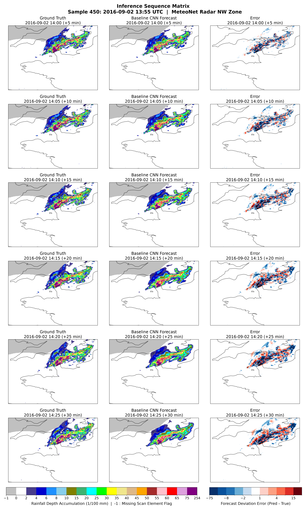

# Precipitation Radar Nowcasting using Deep Learning

<p align="center">
  
</p>
<p align="center"><em>Figure 1: Spatiotemporal nowcasting from historical radar observations to a continuous precipitation forecast.</em></p>


## Project Goals

This project explores the design and engineering of a complete machine-learning pipeline for short-term precipitation radar nowcasting, from raw meteorological archives through preprocessing, sequence generation, model training, hyperparameter optimization, and domain-specific evaluation.

The main goals are:

- **End-to-end ML pipeline:** Transform raw radar archives into reproducible multi-step precipitation forecasts and serve them via a live API microservice.
- **Modular PyTorch & Serving implementation:** Keep data, models, training, evaluation, tuning, visualization, and deployment components strictly separated and reusable.
- **Data-centric development:** Investigate the statistical and meteorological properties of the dataset before making modeling decisions.
- **Reliable evaluation:** Construct training, validation, and test splits with comparable meteorological difficulty rather than relying on arbitrary chronological partitions.
- **Engineering for constrained hardware:** Stream large radar datasets without requiring the complete training period to fit in system memory, while maintaining sufficient throughput for GPU training.
- **Reproducible experimentation:** Track configurations, metrics, checkpoints, and generated artifacts at the experiment level.
- **Baseline-first modeling:** Establish a deliberately simple CNN baseline before introducing explicit temporal modeling, multi-scale skip connections, attention, or specialized losses.
- **Production-Ready Containerized Serving:** Package the model into an isolated, lightweight, config-driven container capable of real-time diskless inference using native streaming formats.

## Description

Precipitation radar nowcasting is the task of predicting the near-future evolution of precipitation fields from recent radar observations. This project uses sequences of historical radar images to predict several future precipitation maps at five-minute intervals.

The core baseline is a fully convolutional **encoder-decoder CNN** implemented in PyTorch. Historical frames are combined along the channel dimension and processed by standard 2D convolutions. This is intentionally not a temporal architecture: the baseline provides a simple reference point against which future models with explicit temporal modeling can be compared.

For serving production requests, a decoupled service layer utilizes **FastAPI** to load model weights dynamically from the experiment registry and execute real-time, low-latency forecasts on streamed matrices without local file lookup overhead.

For the default configuration:

```
Historical Batch Training:
[Raw Radar Archives] ──► [RadarDataset Indexer] ──► [PyTorch DataLoader] ──► [Baseline CNN Training]
                                                                                      │
                                                                           (Saves Checkpoint Weights)
                                                                                      │
Real-Time Serving Inference:                                                          ▼
[Client Request: 6 Raw Frames (.npy)] ──► [FastAPI API Engine] ──► [pipeline.py Preprocessing Bridge]
                                                                                      │
                                                                           (Runs Model Forward Pass)
                                                                                      │
[Client Response: Structured JSON]    ◄── [Nowcast Response]   ◄── [Pydantic Validation Schema Check]

```

The project supports two operational workflows. For offline development, the data framework manages historical lookups, temporal validation filters, and cross-boundary stitching to construct balanced training batches. For online inference, a decoupled service layer handles standalone requests over the network, utilizing an in-memory transformation bridge to feed live stream arrays to the model checkpoint without disk operations.

## Features

### 📦 Data Engineering & Pipeline
* **MeteoNet Radar Ingestion:** Processing of Météo-France rainfall radar archives.
* **Temporal Sequence Validation:** Candidate sequences are checked for exact five-minute temporal continuity.
* **Archive-Boundary Support:** Sequence indexing can span neighboring radar archives instead of discarding valid windows at file boundaries.
* **Data Difficulty Characterization:** Radar archives are characterized using meteorological statistics to construct more representative train/validation/test splits.

### ⚡ Performance Optimization
* **Memory-Efficient Dataset Loading:** Radar archives are loaded lazily rather than concatenated into one global in-memory array.
* **OS-Managed File Caching:** Lazy archive loading relies on the Linux page cache rather than maintaining a separate global Python or LRU cache.
* **Optimized PyTorch Data Loading:** Multiple workers, pinned memory, persistent workers, and prefetching are used to overlap data preparation and GPU computation.
* **Mixed-Precision Training:** Scaled automatic mixed precision (AMP) is used to accelerate training cycles and reduce GPU memory consumption.

### 🧠 Modeling & MLOps Infrastructure
* **Configurable CNN Architecture:** Base channel width, input sequence length, and forecast horizon are configurable.
* **Missing-Pixel Masking:** Invalid radar pixels are represented by validity masks and excluded from masked regression loss and evaluation metrics.
* **Automatic Checkpointing:** Model, optimizer, scheduler, and metrics are saved each epoch during training.
* **Experiment Tracking:** Configuration, training history, runtime information, and best-model information are stored per experiment.
* **Random Hyperparameter Search:** Discrete search spaces can be evaluated automatically in isolated experiment directories.

### 📊 Evaluation & Orchestration
* **Multi-Step Evaluation:** Performance can be evaluated independently for each forecast lead time.
* **Meteorological Verification:** Regression metrics are complemented by threshold-based and spatial diagnostics.
* **Prediction Visualization:** Ground truth, predictions, residuals, forecast-horizon curves, and animations can be generated automatically.
* **Makefile Orchestration:** Common pipeline operations are exposed through reproducible `make` targets and configuration files.
* **Dynamic Configuration Overrides:** Nested configuration values can be overridden from the command line using dot notation.

### 🚀 Production Model Serving
* **Config-Driven Architecture:** The serving layer dynamically reads experiment metadata logs on boot to reconstruct the required neural network blueprint without hardcoded parameters.
* **Diskless Stream Processing:** Binary `.npy` payload streams are parsed directly in-memory, bypassing local storage bottlenecks.
* **Strict Runtime Type Enforcement:** Input structural dimensions and output predictions are parsed and validated at runtime using Pydantic schemas.
* **Unified Native Logging:** API transactions map directly into Uvicorn’s stream-handler log framework for centralized orchestration tracking.
* **Isolated Multi-Stage Containerization:** A production-grade `Dockerfile` bundles the runtime dependencies via a lean Miniconda environment, keeping code execution sandboxed.
* **Local Workspace Volume Isolation:** The model checkpoint engine accesses files via storage volume attachments (`-v`), separating container blueprints from heavy weight assets.
* **Automated Integration Testing:** An isolated automated validation suite tests successful arrays, handles edge cases, and verifies boundary error exception responses.


## Dataset

### MeteoNet

The project uses **MeteoNet**, an open meteorological dataset created by **Météo-France**, the French national weather service.

MeteoNet contains several years of meteorological observations. This project uses the rainfall radar component for the **north-western France (NW)** region.

The original dataset is organized into compressed NumPy archives covering approximately ten-day periods. Each archive contains radar observations together with timestamps and information about missing observations.

### Meteorological Specifications

| Attribute | Specification |
| --- | --- |
| Source | Météo-France MeteoNet |
| Region | Northwestern France |
| Dataset period | 2016–2018 |
| Target | Cumulated rainfall |
| Radar interval | 5 minutes |
| Original spatial size | 784 × 565 pixels |
| Project spatial size | 256 × 256 pixels |
| Spatial resolution | 0.01° (~ 1km × 1km) |
| Coordinate system | EPSG:4326 |
| Missing-value indicator | `-1` |


The rainfall values represent accumulated rainfall in hundredths of millimeters (`10^-2 mm`). Missing radar observations are represented by `-1`.

A complete 11-day radar archive can contain up to 3,168 observations:

```text
11 days × 24 hours × 12 scans/hour = 3168 frames
```

### Raw Archive Structure

The original data is divided into temporal archive parts:

```text
year/
    month/
        part_1.npz
        part_2.npz
        part_3.npz
```

Each radar archive contains arrays corresponding to:

- `data`: radar rainfall maps
- `dates`: timestamp associated with each map
- `miss_dates`: timestamps for missing radar observations

The dataset also provides radar coordinate files containing latitude and longitude values for the original grid.

### Data License & Attribution

The original meteorological data is provided by **Météo-France** through MeteoNet.

For replication and academic use, the project acknowledges:

> Larvor, G., Berthomier, L., Chabot, V., Le Pape, B., Pradel, B., & Perez, L. (2020). *MeteoNet, an open reference weather dataset by METEO FRANCE.*

Please consult the official MeteoNet distribution for the current dataset license and attribution requirements.

## Data Exploration and Preprocessing

The preprocessing pipeline was developed from an initial inspection of the radar data distribution, temporal structure, missing observations, and spatial resolution. Detailed analyses, comparative plots, and implementation benchmarks behind these choices can be found in the accompanying research notebooks:

- **Data Diagnostics**: [`notebooks/01_data_exploration.ipynb`](notebooks/01_data_exploration.ipynb) contains the initial structural inspection, heavy-tailed distribution plots, and temporal continuity analysis.
- **Pipeline Prototyping**: [`notebooks/02_preprocessing_design.ipynb`](notebooks/02_preprocessing_design.ipynb) evaluates geometric downsampling trade-offs, pre-allocation memory benchmarks, and georeferenced validation plots.

The high-level transformation is:

```text
       [Raw radar archives]
                │
                ▼
   [Identify invalid values (-1)]
                │
                ▼
      [Create validity masks]
                │
                ▼
   [Clip extreme rainfall values]
                │
                ▼
      [Resize to 256 × 256]
                │
                ▼
   [Logarithmic transformation]
                │
                ▼
[Normalized training representation]
                │
                ▼
      [Clean Tensors + Masks]
```

### 1. Missing-value handling

The raw data uses `-1` to indicate missing radar pixels or unavailable measurements.

These values cannot be treated as genuine zero rainfall because doing so would introduce artificial observations into the target. The preprocessing pipeline therefore extracts a binary validity mask before applying numerical transformations.

The mask is propagated through preprocessing and is later used by the masked loss and evaluation code.

For resizing:

- rainfall data uses area interpolation;
- validity masks use nearest-neighbor interpolation.

This prevents the validity mask from acquiring artificial fractional values.

### 2. Extreme-value handling

Rainfall is highly sparse and strongly right-skewed. A small number of intense events can contain values far larger than the majority of observations.

The preprocessing pipeline therefore clips values to a configurable physical upper bound before spatial interpolation. This prevents isolated extreme pixels from disproportionately influencing neighboring pixels during resizing.

The current production configuration uses a clipping ceiling of `1500`.

### 3. Logarithmic transformation

The rainfall distribution contains a large concentration of low or zero values and a long high-intensity tail.

A logarithmic transformation is used to reduce this dynamic range:

$$
f(x)=\frac{\log(1+x)}{\log(1+x_{\max})}
$$

with the configured maximum rainfall value used as the normalization reference.

This preserves the ordering of rainfall intensities while allocating more numerical resolution to the low and moderate rainfall range than a simple linear scaling would.

The inverse transformation is applied during physical-space evaluation and visualization when required.

## Model Architecture

The project intentionally begins with a **BaselineCNN** whose purpose is to provide a simple, computationally efficient reference model.

The baseline deliberately avoids explicit temporal modeling. Instead, historical radar frames are stacked along the channel dimension and processed with standard 2D convolutions.

This design provides an important experimental reference:

- the model can learn spatial precipitation structures;
- the implementation remains relatively simple;
- training and debugging are straightforward;
- future temporal architectures can be compared directly against it;
- improvements can be attributed to explicit temporal modeling or other architectural changes rather than simply to increasing model complexity.

Because `Conv2d` operates on four-dimensional tensors `[Batch, Channels, Height, Width]`, the temporal dimension is collapsed into the channel dimension:

```text
[Batch, Seq_Len, Data_Ch, H, W]
              │
              ▼
       Permute & Reshape
              │
              ▼
[Batch, Data_Ch × Seq_Len, H, W]
```

The resulting network has access to all historical frames simultaneously, but it has no explicit representation of temporal order, velocity, or recurrence. This limitation is intentional and makes the architecture a useful baseline for future ConvLSTM, 3D CNN, attention, or transformer-based models.

### Linear Pipeline Flow

Every internal block utilizes a uniform structure: `Conv2d (3x3, Padding=1)` ──► `GroupNorm (groups=4)` ──► `ReLU`.

For the default configuration:

```text
[Input Tensor]   Shape: [B, 12, 256, 256] for 6 historical frames × 2 input channels (data & mask)
      │
      ▼
┌───────────────┐
│ Encoder Blocks│ ──► 2x Conv (c1) ──► MaxPool (2x) ──► [B, c1, 128, 128]
└───────────────┘ ──► 2x Conv (c2) ──► MaxPool (2x) ──► [B, c2, 64, 64]
      │
      ▼
┌───────────────┐
│  Bottleneck   │ ──► 2x Conv (c3) ───────────────────► [B, c3, 64, 64]
└───────────────┘
      │
      ▼
┌───────────────┐
│ Decoder Blocks│ ──► Bilinear Up (2x) ──► 2x Conv (c2) ──► [B, c2, 128, 128]
└───────────────┘ ──► Bilinear Up (2x) ──► 2x Conv (c1) ──► [B, c1, 256, 256]
      │
      ▼
┌───────────────┐
│ Output Layer  │ ──► 1x1 Conv ───────────────────► [B, predict_steps, 256, 256]
└───────────────┘
```

### Layer Breakdown

- **Encoder:** Progressively compresses the spatial resolution (`256 → 128 → 64`) while increasing the feature representation (`c1 → c2 → c3`). This increases the receptive field and provides progressively richer spatial context.
- **Bottleneck:** Performs feature extraction at the lowest spatial resolution and highest channel depth (`c3 = base_channels × 4`).
- **Decoder:** Reconstructs the original spatial resolution using bilinear upsampling (`64 → 128 → 256`) while reducing feature dimensionality.
- **Output mapping:** A final `1×1` convolution maps the decoder representation directly to the requested number of forecast frames.

### Design Decisions

- **2D convolutions:** Chosen deliberately to establish a simple baseline without explicit temporal operators.
- **Temporal stacking:** Historical frames are represented as input channels, allowing the network to combine information from multiple observations while keeping the architecture simple.
- **Group Normalization:** Used instead of Batch Normalization because the relatively small batch sizes used for high-resolution radar data make batch statistics less attractive.
- **Max pooling:** Reduces spatial resolution while increasing the effective receptive field and reducing computational cost.
- **Bilinear upsampling:** Avoids the checkerboard artifacts associated with some transposed-convolution designs while remaining inexpensive.
- **1×1 output convolution:** Provides a lightweight mapping from decoder features to the forecast horizon.

### Parametric Adjustments

The architecture can be configured through:

- **Base Channels:** Controls model width and therefore capacity.
- **Sequence Length ($T_{\text{in}}$):** Controls the historical observation window. Default: 6 frames / 30 minutes.
- **Forecast Horizon ($T_{\text{out}}$):** Controls the number of future frames predicted. Default: 6 frames / 30 minutes.

These parameters allow controlled experiments without changing the model implementation itself.

## Training Pipeline

The training system combines lazy sequence generation, GPU training, validation, scheduling, and checkpointing.

```text
  Preprocessed radar archives
              │
              ▼
      Lazy Dataset Index
              │
              ▼
Temporal continuity validation
              │
              ▼
      PyTorch DataLoader
              │
              ├────────────► Prefetch / pinned memory / workers
              │
              ▼
        Training Loop
              │
              ├── Forward pass
              ├── Masked MSE
              ├── Backward pass
              ├── Gradient handling
              └── Optimizer update
              │
              ▼
          Validation
              │
              ▼
       ReduceLROnPlateau
              │
              ├── Save epoch checkpoint
              ├── Update best checkpoint
              └── Update experiment history
```

### Optimization

- **Optimizer:** AdamW with decoupled weight decay.
- **Scheduler:** `ReduceLROnPlateau` monitors validation loss and reduces the learning rate when progress stalls.
- **Loss:** Masked Mean Squared Error.

The masked loss excludes invalid radar pixels:

$$
\text{Loss} = \frac{1}{\sum M} \sum_{i,j,k} \left(Y_{i,j,k}-\hat{Y}_{i,j,k}\right)^2 M_{i,j,k}
$$

where `M` is the binary validity mask.

### Training Stability

Several issues were encountered during development, particularly when combining log-scaled targets with mixed-precision training.

The production pipeline addresses these through:

- Float32 loss/reduction calculations where numerical precision matters;
- bounded output through a final sigmoid when using normalized `[0, 1]` targets;
- gradient scaling for mixed-precision training;
- defensive gradient-norm tracking;
- gradient clipping;
- GroupNorm for small-batch optimization;
- adaptive learning-rate scheduling.

### Checkpointing and Recovery

Long-running training can take many hours, so experiment state is not treated as a single end-of-run artifact.

Epoch-level checkpoints contain:

- epoch number;
- model state;
- optimizer state;
- scheduler state;
- model configuration;
- training metrics;
- validation metrics.

Training history and experiment metadata are also updated during execution.

This makes interrupted runs recoverable and allows completed epochs to be analyzed even if the process crashes before the requested number of epochs.

## Hyperparameter Search

The baseline CNN is tuned using automated **random search** over a discrete search space.

### Search Space

| Parameter | Values |
| --- | --- |
| Learning rate | `3e-4`, `1e-3`, `3e-3`, `1e-2` |
| Weight decay | `0.0`, `0.01`, `0.05`, `0.1` |
| Batch size | `16`, `32` |
| Base channels | `16`, `24`, `32` |
| Num Groups | `2`, `4`, `8` |

Each trial is isolated into its own experiment directory and records its configuration and performance.

Search results are written to:

```text
output/tuning/<experiment>/random_search_results.csv
```

The search workflow also generates diagnostic plots for trial performance, learning rate sensitivity, and parameter correlations.

### Search Performance Analytics

Below are some of the empirical insights from the hyperparameter sweep:

<p align="center">
  
  
</p>
<p align="center"><em>Figure 2: Search optimization trajectory tracking best-identified trials (left) and evaluation loss mapped against learning rates (right).</em></p>

<p align="center">
  
</p>
<p align="center"><em>Figure 3: Correlation coefficients between hyperparameter adjustments and final validation metrics.</em></p>

## Evaluation

Evaluation is intentionally broader than a single validation loss. For a comprehensive domain-specific evaluation, please refer to [`notebooks/04_verification_analysis.ipynb`](notebooks/04_verification_analysis.ipynb)

### Regression Metrics

The standard continuous metrics are:

- **MAE:** Average absolute prediction error.
- **RMSE:** Penalizes larger errors more strongly than MAE.
- **Masked MSE:** Training objective with invalid pixels excluded.

Metrics are also evaluated separately for each forecast lead time so that degradation from `T+5` through `T+30` minutes can be examined.

### Meteorological Verification

Pixel-wise regression metrics do not fully describe nowcasting quality. A forecast can receive a large pixel-wise penalty because a storm is displaced by a small number of pixels even when its overall structure is physically plausible.

The evaluation framework therefore includes threshold-based and spatial diagnostics such as:

- **CSI:** Critical Success Index.
- **POD:** Probability of Detection.
- **FAR:** False Alarm Ratio.
- **HSS:** Heidke Skill Score.
- **SEDS:** Symmetric Extreme Dependency Score.
- **FSS:** Fractions Skill Score.
- **SAL:** Structure-Amplitude-Location analysis.

These metrics help distinguish different failure modes, including missed precipitation, false alarms, spatial displacement, and structural blurring.

### Baseline Failure Analysis

The baseline CNN provides useful evidence about where a simple spatial encoder-decoder is insufficient.

The most important observed limitation is **spatial structural blurring**, especially for intense convective precipitation at longer forecast horizons.

This is consistent with two properties of the baseline:

1. It optimizes a symmetric pixel-wise MSE objective, encouraging conservative predictions when the exact future location of a small convective cell is uncertain.
2. It has no explicit temporal state. The six historical frames are treated as stacked channels rather than as an ordered sequence with an explicit representation of motion.

The evaluation results therefore provide a concrete starting point for future architectures rather than simply producing a single leaderboard score.

## Results

### Model Configuration

The selected baseline configuration from the hyperparameter search is:

| Parameter | Selected value |
| --- | --- |
| Learning rate | `3e-3` |
| Weight decay | `0.05` |
| Batch size | `16` |
| Base channels | `32` |
| Base channels | `8` |


The baseline contains approximately **420k trainable parameters** depending on the exact configured input/output dimensions. The model was trained, validated and evaluated using the following splits recommended through [`notebooks/03_dataset_difficulty_analysis.ipynb`](notebooks/03_dataset_difficulty_analysis.ipynb) : 
```
  training:     2017-03-01 00:00 to 2017-11-30 23:55

  validation:   2016-04-01 00:00 to 2016-06-30 23:55

  testing:      2016-09-01 00:00 to 2016-11-30 23:55
```

### Final Run Results

| Metric | Value |
| --- | ---: |
| Best epoch | `40` |
| Best validation loss | `0.0007877` |
| Validation MAE | `0.3452` |
| Validation RMSE | `2.377` |
| Test MAE | `0.2875` |
| Test RMSE | `1.686` |
| Test MSE | `0.0006816` |
| Training time | `29951 s` |
| Mean epoch runtime | `749 s` |

### Training History

The training history tracks:

- training and validation loss;
- MAE;
- RMSE;
- learning-rate changes;
- gradient norms;
- epoch runtime.

<p align="center">
  
</p>
<p align="center"><em>Figure 4: Training history showing loss, regression metrics, learning-rate adjustments, gradient behavior, and epoch runtimes.</em></p>

### Forecast-Horizon Performance

Performance is evaluated as a whole, as well as independently across the six forecast steps during evaluation. The figures below show the error growth over consecutive future forecasting time steps ($T+5$ to $T+30$ minutes) on out-of-sample data, detailing the operational degradation profile across each distinct evaluation metric:

| Loss Trajectory | MAE Growth | RMSE Accumulation |
| :-: | :-: | :-: |
|  |  |  |
| *Figure 5: Loss over the forecast horizon.* | *Figure 6: MAE over consecutive time steps.* | *Figure 7: RMSE across the sequence window.* |

### Qualitative Prediction Analysis

The grid below details the model's spatial performance across the entire 6-step predictive horizon ($T+5$ to $T+30$ minutes). It maps the exact error propagation vectors by comparing ground-truth targets directly against model generations.

<p align="center">
  
</p>
<p align="center"><em>Figure 8: Ground truth, prediction, and spatial residuals across the six-step forecast horizon.</em></p>

Qualitative analysis is used alongside numerical metrics to identify failure modes that aggregate statistics can hide.

## Experiment Tracking and Output Organization

Each experiment is stored in a timestamped run directory containing the artifacts required to reproduce or inspect that run.

Typical training artifacts include:

```text
output/models/<experiment>/
├── checkpoints/
│   ├── _best_epoch.pt
│   ├── _epoch-1.pt
│   ├── _epoch-2.pt
│   └── ...
├── experiment.json
├── history.json
└── training_history.png
```

Evaluation runs contain prediction and visualization artifacts:

```text
output/evaluation/<experiment>/
├── predictions/
│   ├── chunk_000.npz
│   ├── chunk_001.npz
│   ├── ...
│   └── manifest.json
├── plots/
│   ├── prediction_250.png
│   ├── horizon_loss.png
│   └── ...
├── test.json
├── calculated_verification_metrics.json
└── spatial_mae_footprint.npy
```

Hyperparameter searches are stored separately under:

```text
output/tuning/<experiment>/
├── plots/
│   ├── correlation.png
│   ├── learning_rate_vs_loss.png
│   └── ...
└── random_search_results.csv
```

Local execution logs are written to:

```text
output/logs/
├── evaluate/
│   ├── <experiment>.log
│   └── ...
├── preprocess/
│   ├── <experiment>.log
│   └── ...
├── search/
│   ├── <experiment>.log
│   └── ...
├── stratify/
│   ├── <experiment>.log
│   └── ...
└── train/
    ├── <experiment>.log
    └── ...
```

The exact artifact set can vary depending on the pipeline stage.

## Notebooks

The Jupyter notebooks document the analytical development process and provide reproducible demonstrations of the reasoning behind the production pipeline.

They are intended to show both exploratory data-science work and model diagnostics.

Typical analyses include:

- radar-data exploration and distribution analysis;
- preprocessing decisions;
- individual prediction inspection;
- forecast-horizon degradation;
- dataset difficulty characterization;
- experiment and hyperparameter comparison;
- advanced meteorological verification.

The notebooks complement the production code rather than replacing it.

## Engineering Challenges & Design Decisions

### 1. Temporal continuity

**Challenge:** Missing radar scans can create artificial time gaps.

**Decision:** Validate every candidate sequence and require exact five-minute spacing across the complete input and target window.

**Result:** The model never receives a sequence where an arbitrary temporal gap is incorrectly interpreted as five minutes.

### 2. Cross-archive sequences

**Challenge:** MeteoNet is split into separate archive files, but valid prediction windows can cross archive boundaries.

**Decision:** Build sequence indices independently of physical file boundaries and allow neighboring archives to provide the required frames.

**Result:** Valid windows at archive boundaries are retained without treating files as independent datasets.


### 3. Missing spatial measurements

**Challenge:** Missing radar pixels must not be interpreted as physical zero rainfall.

**Decision:** Extract validity masks during preprocessing and propagate them through training and evaluation.

**Result:** Invalid pixels do not contribute to the masked loss or reported metrics.

### 4. Training stability and gradient monitoring

**Challenge:** Early training runs occasionally produced `inf` or missing gradient-norm values. Invalid diagnostics made it difficult to distinguish a genuine optimization problem from a problem in the monitoring calculation itself.

**Decision:** Treat gradient norm as a first-class training diagnostic, investigate invalid values rather than silently ignoring them, and make the calculation robust to the actual optimizer/training state. Gradient clipping is used where configured to prevent excessively large updates.

**Result:** Gradient norms can be monitored throughout training and used to identify changes in optimization behavior. In later runs, the recorded gradient norms remain finite and interpretable.

### 5. Baseline architecture selection

**Challenge:** A complex temporal model would make it difficult to determine which design choice caused an observed improvement.

**Decision:** Start with a deliberately simple 2D CNN baseline.

**Result:** Future ConvLSTM, 3D CNN, U-Net, attention, or transformer models have a clear reference point.

### 6. Long-running experiment recovery

**Challenge:** Training and hyperparameter searches can run for many hours and can fail before the final epoch.

**Decision:** Save checkpoints and experiment state at epoch level.

**Result:** Completed training work is not lost after an interruption, and experiments can be inspected or resumed from saved state.

### 7. Reproducible execution

**Challenge:** A pipeline with many scripts and command-line options can become difficult to execute consistently.

**Decision:** Centralize execution through the root `Makefile`, YAML configuration files, and explicit output directories.

**Result:** Common preprocessing, training, tuning, and evaluation workflows can be launched consistently.


## Project Structure

The repository is organized around the ML lifecycle:

```text
precipitation-nowcasting/
├── assets/             # Documentation visuals and diagrams
├── configs/            # YAML configuration files for for pipeline reproducibility
├── data/               # Local dataset files (MeteoNet raw .npz and processed .npy)
├── deployment/         # 🚀 Production Serving Infrastructure Layer
│   ├── app.py          # FastAPI web service endpoint mapping and setup logic
│   ├── pipeline.py     # Live matrix preprocessing and validation bridge
│   ├── schemas.py      # Strict runtime Pydantic response data schemas
│   └── test_api.py     # Endpoint automated integration test execution suite
├── devblog/            # 📖 Technical engineering articles and design journals
├── notebooks/          # Exploration, prototyping, and evaluation
├── output/             # Model Checkpoints, test predictions, metrics, metadata, and plots
└── src/                # Modular application source (data, models, training, tuning)
```

- **Deep Learning / Core:** Python 3.11, PyTorch (AMP, DataLoaders), NumPy, Pandas, Scikit-Learn
- **Serving / Devops:** FastAPI, Uvicorn, Pydantic, Docker (Multi-stage builds), Make/Bash

## Installation

### Prerequisites

The project is designed for an NVIDIA GPU environment with a compatible CUDA-enabled PyTorch installation and Conda/Miniconda.

### Environment Setup

```bash
git clone <repository-url>
cd precipitation-nowcasting

conda env create -f environment.yml
conda activate weather-ml
```
The environment file enforces specific versions of certain packages to ensure compatibility with Cartopy for proper coastline plotting.

## Usage

The complete pipeline is orchestrated through the root-level `Makefile`. Runtime parameters are defined in YAML configuration files under `configs/`, making experiments fully reproducible while still allowing command-line overrides when required.


### Pipeline Overview

```text
   Download MeteoNet
          │
          ▼
     Preprocessing
          │
          ▼
Archive Characterization
          │
          ▼
       Training
          │
          ▼
 Hyperparameter Search
          │
          ▼
      Evaluation
          │
          ▼
     Visualization
```


## Configuration

Each pipeline stage uses its own configuration file.

| Stage | Configuration |
|--------|---------------|
| Preprocessing | `configs/preprocess.yml` |
| Archive Characterization | `configs/stratify.yml` |
| Training | `configs/train_baseline.yml` |
| Hyperparameter Search | `configs/search.yml` |
| Evaluation | `configs/evaluate.yml` |
| Visualization | `configs/plotting.yml` |

Most parameters can also be overridden directly from the command line.


## 1. Download MeteoNet

Download the MeteoNet rainfall radar dataset from the official distribution and preserve the directory structure under

```text
data/raw/
```

Only the outer archive layers (`.tar`, `.tar.gz`) should be extracted. The radar archives themselves remain in their original `.npz` format and are processed automatically during preprocessing.


## 2. Preprocessing

Run

```bash
make preprocess
```

Configuration:

```text
configs/preprocess.yml
```

This stage

- extracts the MeteoNet archives;
- resizes radar images;
- clips extreme rainfall values;
- applies logarithmic normalization;
- generates validity masks for missing pixels;
- stores processed archives as uncompressed `.npy` arrays.

Output:

```text
data/processed/
```

Since the processed arrays are stored uncompressed for efficient memory mapping, preprocessing requires substantial disk space (approximately **100 GB** for the complete three-year dataset at **256×256** resolution).


## 3. Archive Characterization

Run

```bash
make stratify
```

Configuration:

```text
configs/stratify.yml
```

This stage computes meteorological difficulty statistics for every archive, including

- rainfall frequency;
- heavy rainfall frequency;
- spatial variance;
- temporal variability;
- rainfall intensity distribution;
- archive difficulty score.


Output:

```text
data/difficulty/
```

These statistics are used to construct balanced training and validation splits for robust model evaluation in `notebooks/03_dataset_difficulty_analysis.ipynb`.


## 4. Training

Run

```bash
make train
```

Configuration:

```text
configs/train_baseline.yml
```

Individual parameters may be overridden without modifying the configuration file.

Example:

```bash
make train \
OPTS="optimization.batch_size=32 optimization.learning_rate=1e-3 model.base_channels=24"
```

Each training run creates a timestamped experiment directory containing checkpoints, experiment info etc. in

```text
output/models/
```

---

## 5. Hyperparameter Search

Run

```bash
make search
```

Configuration:

```text
configs/search.yml
```

The search performs randomized sampling over predefined hyperparameter distributions and automatically stores every experiment separately together with its corresponding metrics.

---

## 6. Evaluation

Run

```bash
make evaluate
```

Configuration:

```text
configs/evaluate.yml
```

If no experiment directory is specified, the latest training run is selected automatically.

Evaluation produces

- prediction tensors;
- evaluation metrics;
- forecast horizon metrics;
- visualization artifacts.

Outputs are written to

```text
output/evaluation/
```

---

## 7. Standalone Production Model Serving

You can launch, manage, and test the model-serving layer using either your local Conda workspace or an isolated Docker deployment container.

### Local Serving Development Mode
To boot up the FastAPI execution server locally inside your active `weather-ml` environment with hot-reloading enabled, run:
```bash
make api-dev
```
The application will automatically locate the latest run inside `output/models/`, reconstruct the specific architecture, load your weights state dictionary, and open communication lines on port `8000`.

### Production-Grade Container Mode
To build an isolated, self-contained multi-stage Docker environment container blueprint using the updated library structures, trigger:
```bash
make docker-build
```

To run the compiled container server safely isolated from local system paths (utilizing storage volume mapping hooks `-v` to dynamically grant weight access), run:
```bash
make docker-run
```
*(Note: Close down any running local `api-dev` server panels prior to launching the container so that Port 8000 is open.)*

### Executing the Automated Verification Suite
While the server is running (either locally or inside Docker), open an adjacent terminal window panel and launch the integration test framework:
```bash
make api-test
```
This script automatically validates structural metadata responses, feeds synthetic 3D radar sequences, handles missing data mask tokens, and tests client boundary protection filters.


## 8. Visualization

The corresponding visualization scripts are automatically called at the end of successful training, evaluation, or tuning runs. However, if a run is cut short or specific outputs need closer inspection, standalone commands are available.

### Prediction Plots & Animation Utilities

Since prediction grids and animations visualize a specific designated test sample, they can be invoked independently. If no explicit target directory is specified, they automatically locate and load data from the latest available evaluation run.

Prediction inspection grid:
```bash
make plot_grid
```

Animated convective nowcasting loops:
```bash
make plot_gif
```

Configuration:
```text
configs/plotting.yml
```

### Interrupted Run Recovery Commands

If a training session or a hyperparameter search sweep is forcefully aborted, interrupted by system power-offs, or crashes before reaching its natural end, the automatic post-run plotting scripts will fail to trigger. Use these dedicated recovery targets to retroactively generate your diagnostic plots without rerunning the models:

*   **Rescue Training Curves:** Computes macroscopic/microscopic loss curves, validation metrics, learning rate history, gradient norm tracks, and compute runtimes straight out of an interrupted run's log history.
    ```bash
    make plot_history
    ```
    *By default, it auto-fetches the latest timestamped folder in `output/models/`. Pass `OPTS="--experiment-dir output/models/TARGET_FOLDER"` to target an older run.*

*   **Rescue Hyperparameter Sweeps:** Processes trial loss charts, cumulative minima convergence maps, top 10 run comparisons, multi-parameter scatter matrices, and importance heatmaps out of an interrupted sweep log.
    ```bash
    make plot_search
    ```
    *By default, it auto-fetches the latest timestamped folder in `output/tuning/`. Pass `OPTS="--results-dir output/tuning/TARGET_FOLDER"` to target an older sweep.*

Generated visualizations include

- prediction grids;
- animated GIFs;
- forecast horizon analysis;
- individual sample inspection;
- single-run epoch loss and metric histories;
- multi-trial random search parameter matrices.


## Cleaning

Remove Python cache files with

```bash
make clean
```

## Future Improvements

The current baseline establishes a foundation for several possible research and engineering directions.

### Modeling

- ConvLSTM or other recurrent convolutional architectures for explicit temporal memory.
- 3D CNNs for joint spatiotemporal convolutions.
- U-Net-style skip connections for improved fine-scale spatial reconstruction.
- Attention and Vision Transformer architectures for longer-range dependencies.
- Advection-guided architectures using optical-flow information.
- Physics-informed constraints such as precipitation-mass conservation.


### Losses and Evaluation

- Asymmetric losses (e.g. Huber loss) that penalize heavy-rain underprediction more strongly.
- Perceptual or structural losses to reduce spatial blurring.
- Expanded meteorological verification metrics.
- Power spectral density analysis for high-frequency structural fidelity.
- Additional persistence and optical-flow baselines.

### Data and Validation

- Support for additional dataset split strategies.
- Blocked or grouped cross-validation with explicit temporal buffers.
- Further automated meteorological-regime balancing.
- More robust radar artifact and clutter filtering.
- Additional regions and radar products.

### Infrastructure

- Automated unit and integration testing with `pytest`.
- CI/CD workflows for linting and validation.
- Distributed multi-GPU training with PyTorch DDP.
- Support for continuing training and resuming interrupted hyperparameter searches.
- Atomic checkpointing.
- Support for continuous rather than discrete random-search distributions.
- Database-backed experiment tracking instead of JSON/CSV files.
- ONNX export and lightweight inference deployment.
- Interactive web-based prediction dashboards (e.g., using Streamlit) that query the running FastAPI Docker microservice over network ports to render predictions on the fly.


### Code Quality and Maintainability

- Comprehensive Python type hints across function signatures to enhance IDE autocomplete and self-documentation.
- Static type checking integration using `mypy` to catch data type mismatches prior to execution.
- Automated code formatting and linting pipelines (e.g., using `ruff`, `black`, or `flake8`).


### Feature Engineering

- Extra input channels for spatial gradients (e.g., Sobel) to explicitly highlight convective storm fronts.
- Pixel-wise temporal differencing ($\Delta t$) channels to provide the network with immediate motion and intensity growth cues.
- Distance transforms on validity masks to inform the model of proximity to missing data boundaries.
- Normalized coordinate grids stacked as static input channels to induce spatial and geographic awareness.

## AI-Assisted Development

This project was developed with the assistance of modern AI coding tools (primarily OpenAI's ChatGPT and Google's Gemini).

AI was used as an engineering productivity tool for:

- brainstorming implementation approaches;
- discussing software architecture trade-offs;
- reviewing code structure and documentation;
- generating initial drafts of boilerplate code;
- improving README organization and technical writing.

All architectural decisions, algorithm selection, implementation details, debugging, validation, experimentation, and performance optimization were performed and verified manually. Every generated code fragment was reviewed, modified where necessary, integrated into the overall project, and experimentally validated before inclusion.


## Acknowledgements

- **Météo-France** — for curating and publishing the MeteoNet dataset.
- **PyTorch contributors** — for the deep learning framework.
