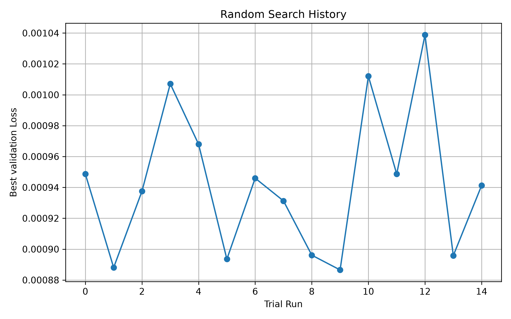
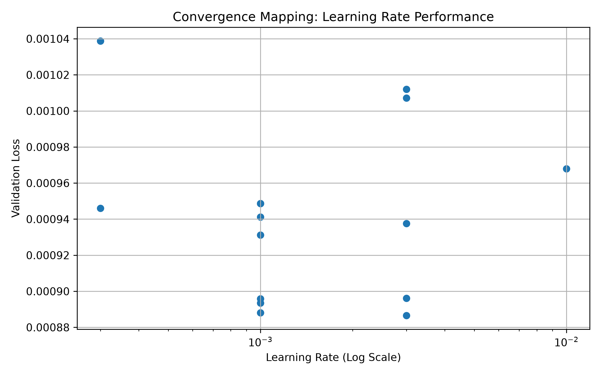
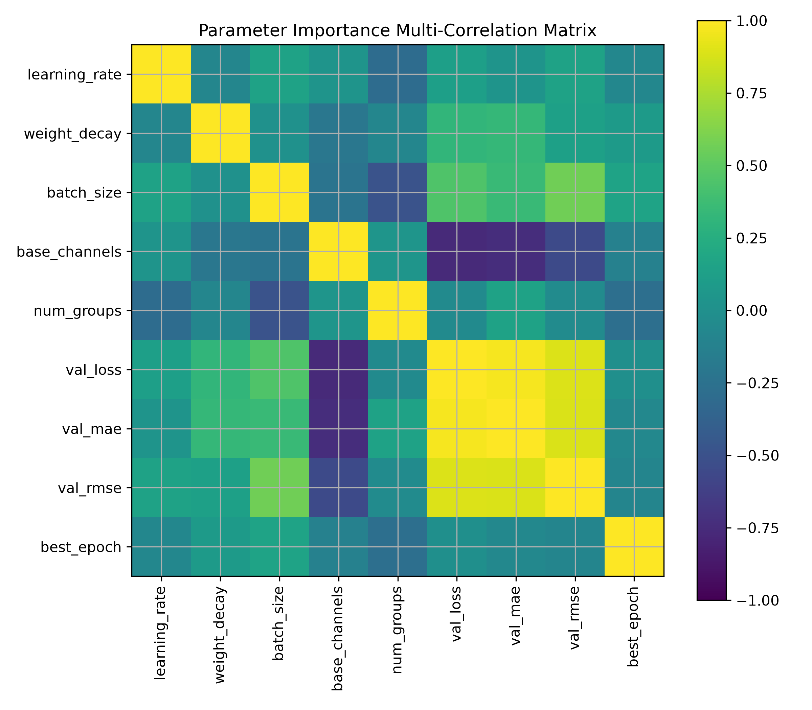
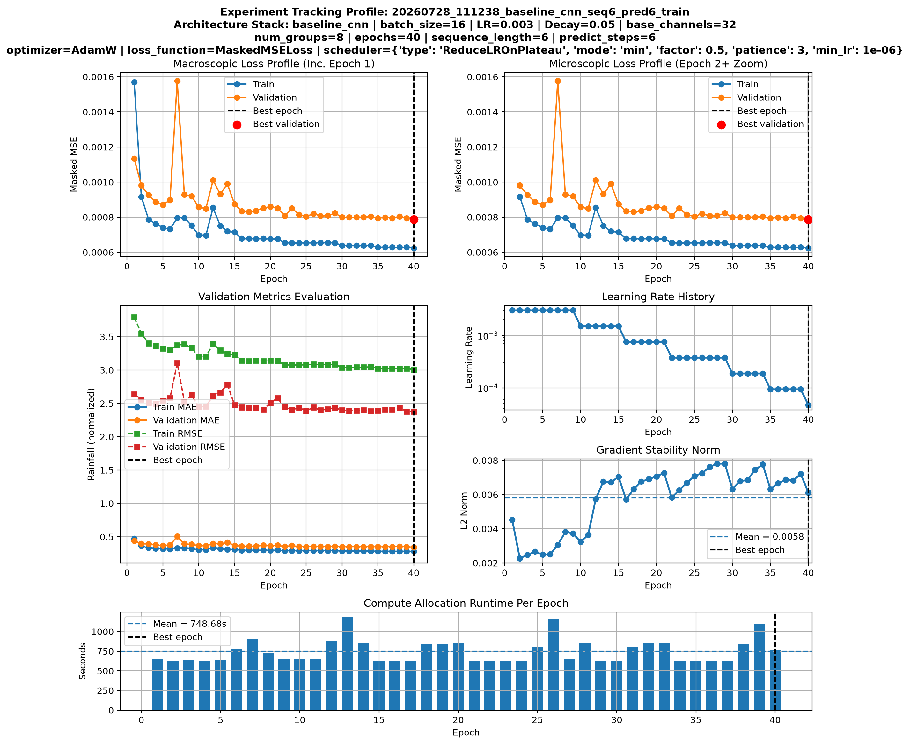
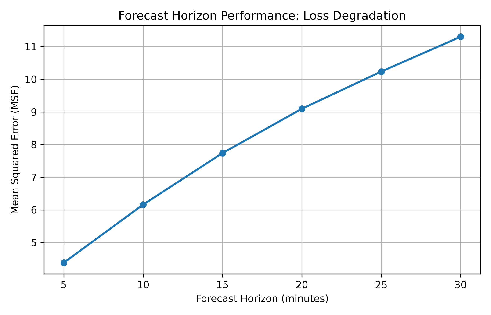
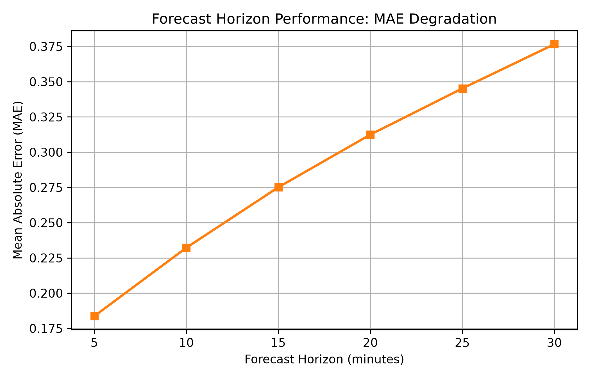
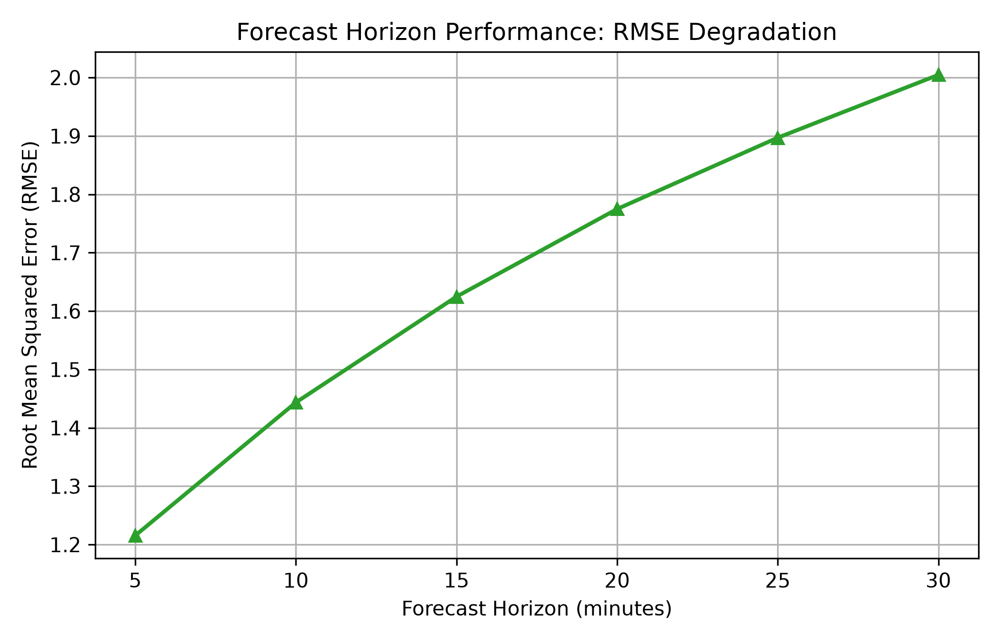

# 📖 DevBlog: Baseline CNN Architecture, Masked Loss, & Tuning Analytics

**Author:** Dennis Bob Talanga  
**Category:** Deep Learning Architecture & Computer Vision  
**Context:** Project *Precipitation Radar Nowcasting using Deep Learning*

---

## Architectural Philosophy: Stacking vs. Recurrence
The core modeling framework intentionally begins with a deterministic **BaselineCNN** to establish a simple, computationally efficient spatial reference point. 

Because `Conv2d` blocks natively operate on four-dimensional tensors `[Batch, Channels, Height, Width]`, the temporal dimension is collapsed into the channel dimension via structural permutation:

$$
\text{Input Dimensions: } [B, T_{\text{in}}, C_{\text{data}}, H, W] \longrightarrow \text{Reshaped Dimensions: } [B, C_{\text{data}} \times T_{\text{in}}, H, W]
$$

For the production configuration, this results in an input footprint of `[Batch, 12, 256, 256]`, mapping 6 historical frames containing 2 feature channels each (normalized radar intensity and its corresponding binary validity mask). This channel-stacking methodology grants the spatial convolutional layers access to all historical context simultaneously. However, it provides the network with no explicit recurrent representation of temporal order, velocity vectors, or atmospheric momentum. This structural limitation is entirely intentional, creating a rigid baseline against which future spatiotemporal models (ConvLSTM, 3D-CNNs, Transformers) can be rigorously isolated and benchmarked.

---

## The Masked Mean Squared Error Objective
To guarantee that invalid sensor dropouts or unmeasured data blocks never compute gradients or affect backpropagation updates, the optimization loops utilize a strict **Masked MSE Loss**. The loss is dynamically bound directly into the model execution graphs, dividing the squared errors exclusively over active, valid coordinates:

$$
\text{Loss}_{\text{Masked}} = \frac{1}{\sum M_{i,j,k}} \sum_{i,j,k} \left(Y_{i,j,k}-\hat{Y}_{i,j,k}\right)^2 M_{i,j,k}
$$

where `M` is the binary validity mask.

### Native PyTorch Implementation Hook
```python
import torch
import torch.nn as nn


class MaskedMSELoss(nn.Module):

    def __init__(self, reduction="mean"):
        super().__init__()
        self.reduction = reduction

    def forward(self, prediction, target, mask):
        # Cast everything to Float32 to prevent underflow
        prediction = prediction.float()
        target = target.float()
        mask = mask.float()

        loss = (prediction - target) ** 2
        loss = loss * mask

        if self.reduction == "sum":
            return loss.sum()
        if self.reduction == "none":
            return loss

        # Add an epsilon (1e-7) to prevent dividing by 0 if a patch has no valid pixels
        return loss.sum() / (mask.sum().clamp(min=1.0) + 1e-7)
```

---

## Structural Pipeline Flow & Layer Breakdown

The network follows a highly symmetric linear encoder-decoder topology comprising approximately **420k trainable parameters**:

```text
[Input Tensor: B, 12, 256, 256]
      │
      ▼
┌───────────────┐
│ Encoder Blocks│ ──► 2x Conv (c1) ──► MaxPool (2x) ──► [B, c1, 128, 128]
└───────────────┘ ──► 2x Conv (c2) ──► MaxPool (2x) ──► [B, c2, 64, 64]
      │
      ▼
┌───────────────┐
│  Bottleneck   │ ──► 2x Conv (c3) ───────────────────► [B, c3, 64, 64]
└───────────────┘
      │
      ▼
┌───────────────┐
│ Decoder Blocks│ ──► Bilinear Up (2x) ──► 2x Conv (c2) ──► [B, c2, 128, 128]
└───────────────┘ ──► Bilinear Up (2x) ──► 2x Conv (c1) ──► [B, c1, 256, 256]
      │
      ▼
┌───────────────┐
│ Output Layer  │ ──► 1x1 Conv ───────────────────► [B, T_out, 256, 256]
└───────────────┘
```

Every internal processing block utilizes a uniform, hardware-optimized structure:

$$
\text{Conv2D (3x3, Padding=1, No Bias)} \longrightarrow \text{GroupNorm (groups=4)} \longrightarrow \text{ReLU}
$$

**Sigmoid Functional Bounding:** Because the logarithmic range compression scales the target precipitation array values into a standardized normalized range strictly between 0 and 1, the output layer passes the 1x1 convolution logits directly through a final element-wise **Sigmoid activation function**. This architectural design choice acts as a strict mathematical guardrail, forcing the neural network to restrict its predictive outputs within identical physical boundaries $[0, 1]$ and preventing unstable out-of-range numerical explosions.

---

## Hyperparameter Search Performance Analytics

The baseline CNN is tuned using automated random search over a discrete search space. Each trial is isolated into its own experiment directory, recording its configuration and performance to `output/tuning/<experiment>/random_search_results.csv`. 

The search workflow generates empirical diagnostic plots tracking the optimization trajectory, learning rate sensitivity, and parameter correlations:

<p align="center">
  
  
</p>
<p align="center"><em>Figure 1: Search optimization trajectory tracking best-identified trials (left) and evaluation loss mapped against learning rates (right).</em></p>

<p align="center">
  
</p>
<p align="center"><em>Figure 2: Correlation coefficients between hyperparameter adjustments and final validation metrics.</em></p>

### Final Model Configuration

The selected baseline configuration from the hyperparameter search is:

| Parameter | Selected value |
| --- | --- |
| Learning rate | `3e-3` |
| Weight decay | `0.05` |
| Batch size | `16` |
| Base channels | `32` |
| Base channels | `8` |

---

## Empirical Optimization Dynamics & Final Run Results

The training history tracks macroscopic loss curves, continuous regression metrics, learning-rate adjustments, gradient scaling behavior, and exact computational epoch runtimes to monitor optimization stability.

<p align="center">
  
</p>
<p align="center"><em>Figure 3: Training history showing loss, regression metrics, learning-rate adjustments, gradient behavior, and epoch runtimes.</em></p>

### Forecast-Horizon Performance

Performance is evaluated as a whole, as well as independently across the six forecast steps during evaluation. The figures below show the error growth over consecutive future forecasting time steps ($T+5$ to $T+30$ minutes) on out-of-sample data, detailing the operational degradation profile across each distinct evaluation metric:

| Loss Trajectory | MAE Growth | RMSE Accumulation |
| :-: | :-: | :-: |
|  |  |  |
| *Figure 4: Loss over the forecast horizon.* | *Figure 5: MAE over consecutive time steps.* | *Figure 6: RMSE across the sequence window.* |

### Final Baseline Execution Metrics
When executed on the stratified split configurations recommended through the data-centric difficulty analysis, the final optimized baseline profile recorded the following concrete computational, mathematical, and out-of-sample physical signatures:

| Pipeline Diagnostic Metric | Logged Baseline Value |
| :--- | :--- |
| **Best Training Epoch** | `40` |
| **Best Validation Loss (Masked MSE)** | `0.0007877` |
| **Validation MAE** | `0.3452` |
| **Validation RMSE** | `2.377` |
| **Out-of-Sample Test MAE** | `0.2875` |
| **Out-of-Sample Test RMSE** | `1.686` |
| **Out-of-Sample Test MSE** | `0.0006816` |
| **Total Pipeline Training Time** | `29951 s` (~8.3 Hours) |
| **Mean Epoch Runtime Overhead** | `749 s` |


---

## Diagnostic Analysis: The Spatial Blurring Phenomenon

Qualitative inspection of out-of-sample inference matrices reveals a significant, systematic failure mode at longer forecasting horizons (T+25 to T+30 minutes): **pronounced spatial structural blurring**, particularly along high-intensity convective storm boundaries.

This diagnostic behavior is highly interpretable and stems directly from two core properties of the baseline environment:
1.  **Symmetric Objective Optimization:** The model optimizes a pixel-wise Mean Squared Error (MSE) loss function. Because predicting the exact future geographic coordinate of a localized, chaotic convective cell miles away is highly volatile, an MSE loss mathematically drives the network to output a conservative, smoothed spatial mean to hedge its penalties.
2.  **Lack of Velocity Awareness:** Because historical frames are stacked flatly into channels, the 2D spatial kernels cannot natively compute motion vectors or track temporal rotation. The model cannot propagate fluid structures forward dynamically, resorting to spatial smoothing as forecast horizons expand. 
